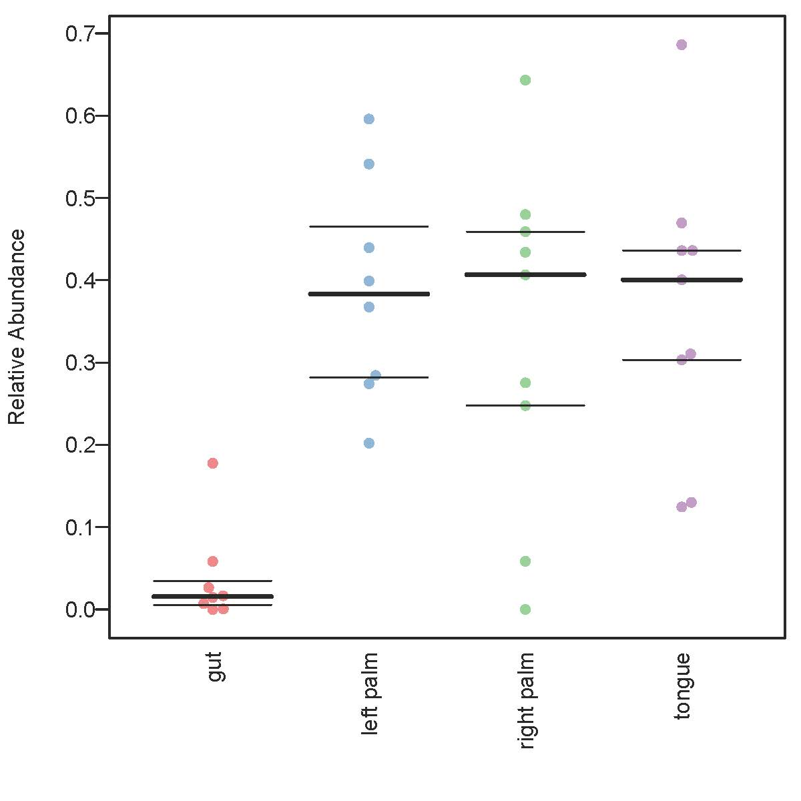

# Aim #
This is a simple workflow that aims to help create a BugBase-compatible biom file from within Qiime2. The BugBase pre-print can be found [here]( https://www.biorxiv.org/content/early/2017/05/02/133462). For additional details see its [documentation page]( https://bugbase.cs.umn.edu/documentation.html). As BugBase utilizes PICRUSt for its functional category predictions, the output table here is therefore also PICRUSt-compatiable. Note that there is a [PICRUSt2](https://github.com/picrust/picrust2/wiki) which users should consider if they are not looking to use BugBase. I was/am not involved with BugBase or PICRUSt in any capacity, this is just a crude workaround that I found useful and thought others might benefit from.

Here I outline my approach for use with 16S data, not shotgun metagenomic data. I've tested this with Qiime2 version 2018.8.

Since BugBase requires as its input, an OTU table picked against the Greengenes database, I chose to cluster the DADA2-denoised reads from the Moving Pictures tutorial using `vsearch`.

You can use dereplicated sequences without denoising but I personally believe it’s better to utilise denoised reads even if OTU picking methods will ultimately be used.

First though we’ll need some files, which I’ll put into one folder.
Download the feature table and representative sequences which are the output of DADA2 from the [Moving Pictures tutorial]( https://docs.qiime2.org/2018.8/tutorials/moving-pictures/#option-1-dada2).

[rep-seqs-dada2.qza](https://docs.qiime2.org/2018.8/data/tutorials/moving-pictures/rep-seqs-dada2.qza)   
[table-dada2.qza](https://docs.qiime2.org/2018.8/data/tutorials/moving-pictures/table-dada2.qza)

Next, we’ll need the Greengenes reference database, which we can download from the [resource page]( https://docs.qiime2.org/2018.8/data-resources/#greengenes-16s-rrna). I downloaded the 13_5 version here.

   
<!--**Q:Can BugBase use 13_8? Since the original PICRUSt version required 13_5?**-->

We’re going to need to import the 97% OTU fasta file (from the rep-set folder) into Qiime2. You could use a different % here if you want, ex. 99%.

    qiime tools import \
    --type 'FeatureData[Sequence]' \
    --input-path 97_otus.fasta \
    --output-path gg_97_otus.qza

Now I use vsearch to cluster the sequences at 97% similarity threshold.


    qiime vsearch cluster-features-closed-reference \
    --i-sequences rep-seqs-dada2.qza \
    --i-table table-dada2.qza \
    --i-reference-sequences gg_97_otus.qza \
    --p-perc-identity 0.97 \
    --o-clustered-table table-cr-97.qza \
    --o-clustered-sequences rep-seqs-cr-97.qza \
    --o-unmatched-sequences unmatched-seqs \
    --verbose


BugBase requires that the biom table be in version 1.0 JSON format, and have taxonomy annotations instead of OTU IDs, so we need to do some adjustments first.

To do this we’ll need the underlying biom table within the `table-cr-97.qza` artifact.

    qiime tools export \
    --input-path table-cr-97.qza \
    --output-path $PWD

This saves the exported biom table and calls it `feature-table.biom`.

<!--**When I try to validate the biom table here:
`biom validate-table -i feature-table.biom`
I get:
"Unknown table type, however that is likely okay.
The input file is not a valid BIOM-formatted file." 
#Any idea why this is? If I convert it to json format this goes away. Not really an issue, just seemed odd to me**-->

Right now, our biom table has OTU ID# and not taxonomic annotations. So we’ll go ahead and add those taxonomies in. For this we need the `97_otu_taxonomy.txt` file (use the same % identity used at your clustering step) that can be found in the Greegenes files we downloaded earlier within the `taxonomy` sub-folder.

In order to add taxonomy to our biom file first we need to add a new header to the `97_otu_taxonomy.txt` file.

There are many ways to do this, but I simply opened the `97_otu_taxonomy.txt` file with excel and manually added `#OTUID`, and `taxonomy` headers by inserting them above the first row. Save.

Now we're ready to add taxonomy.
```
biom add-metadata -i feature-table.biom -o feature-table-tax.biom --observation-metadata-fp 97_otu_taxonomy.txt --sc-separated taxonomy
```
Finally, BugBase requires an older version of BIOM file (V1.0 JSON). I found a crude but simple solution to this which is to just convert our biom file to a .txt file then reconvert back using an older biom version.

First, convert this to a .txt file:
```
biom convert --table-type="OTU table" -i feature-table-tax.biom -o feature-table-tax.txt --to-tsv --header-key taxonomy
```
Then re-convert back to the older biom version we need.

```
biom convert -i feature-table-tax.txt -o feature-table-tax-biom1.biom --table-type="OTU table" --to-json --process-obs-metadata taxonomy
```

This table is now compatible with BugBase. I tested this by uploading it on the [web-based version of BugBase]( https://bugbase.cs.umn.edu/upload.html). Optionally you can upload a metadata file though a couple of minor adjustments also need to be made here for BugBase compatibility. The metadata table for this dataset can be downloaded [here]( https://data.qiime2.org/2018.8/tutorials/moving-pictures/sample_metadata.tsv). You will have to manually rename the first column to `sample-id` as per BugBase’s requirement, and also delete the second row which describes the column categories. Save this file as tab-delimited text file and you’re set to go.

The image below was obtained using the web version of BugBase with all default settings and groups set to BodySite. It shows the predicted phenotypic trait (Aerobic) of the different body sites.


